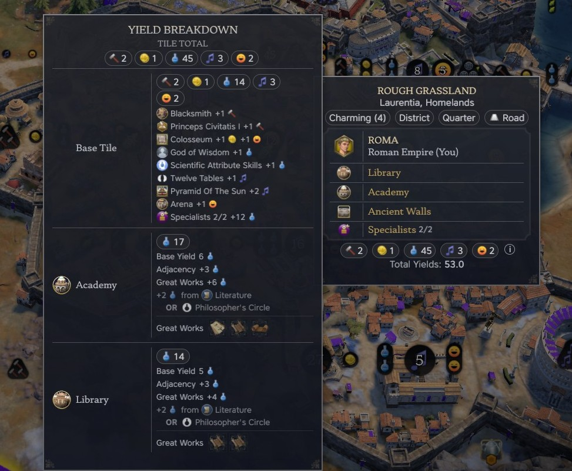
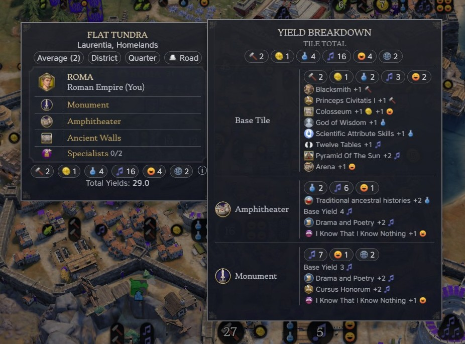
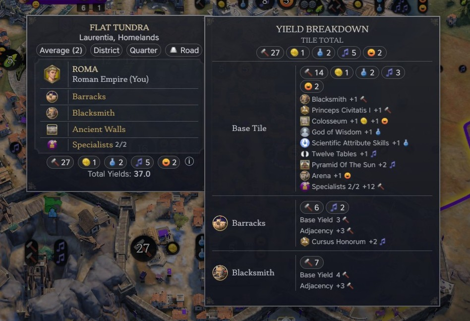

# Better Yield Tooltip

A Civilization VII mod that shows where a tile's yields come from.

The game says a tile makes 9 Science. This mod says why: base tile,
adjacency, each building's own yield, Great Works, policies, pantheon, civ and
leader abilities, specialists and appeal, each with its amount.

## How to use it

With a mouse:

1. Hover a tile.
2. Press **K** to lock the tooltip.
3. Hover the row of yield icons at the bottom of the tooltip.

With a controller:

1. Move the cursor over a tile.
2. Click the left stick to lock the tooltip.
3. Press left or right on the d-pad until the breakdown opens.

The breakdown opens beside it: the tile first, then each building on it. Every
number comes from the game. The mod only works out which source each one
belongs to.

When the game gives an amount with no source, the mod matches it against your
bonuses. If one bonus fits exactly, it is named. If several could fit, the line
is dimmed and lists them, for example "+2 Science from Literature OR
Philosopher's Circle". Anything left over is shown as **Unattributed**.

## Compatibility

- The mod only changes the interface. You can add it to a game in progress or
  remove it without breaking the save.
- It works by replacing the tooltip's yield bar. Another mod that replaces the
  yield bar will clash with it, and only one of them will show.

## AI use

The code and docs for this mod were written with AI, using Claude Code. The
mod is tested by playing the game.

## Contributing

See [CONTRIBUTING.md](CONTRIBUTING.md).

## Licence

MIT. See [LICENSE](LICENSE).
